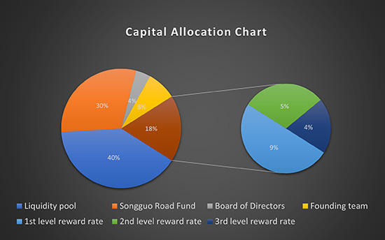
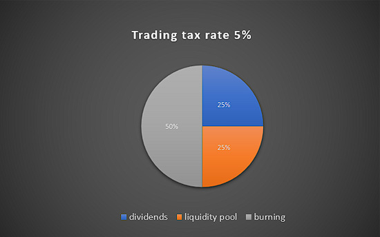

# Issuance and Distribution

## How to obtain Pinecone Token (PCT)

1. Initial Purchase: Although PCT can be purchased during the issuance on Uniswap, we recommend obtaining it through donation.&#x20;
2. Donation to Upgrade Genesis Account: Invited genesis accounts can upgrade to Pine Tree accounts by donating 15 USDT, and earn 10,000 PCT through mining.&#x20;
3. Donation through Referral Page: By donating 30 USDT through the referral page, you can receive 10,000 PCT generated by a Pine Tree. There is no need for mining, and PCT will be credited directly.

## **Allocation & Token Economics**

Pinecone Token (PCT) is the native token of the PineconeDAO platform, and its token economic model aims to achieve a fair, transparent, and fun way of wealth growth. With gamification elements at its core, centered around the mining concept of pine trees producing pinecone tokens, the design of Pinecone Token encourages users to participate in platform building and jointly promote the development of Web3.0 technology.

On the PineconeDAO platform, token distribution and management include four account types: Standard Account, Genesis Address, Pine Tree Account, and Director Account. The total supply is 210,000,000,000 PCT, with 21,000,000 pine trees, each capable of producing 10,000 PCT. Users can obtain a pine tree and the corresponding pinecone token mining rights by donating 15 USDT. When a user donates for 10 pine trees, they will receive a Mystery Key NFT, a unique NFT that is the only way to participate in the grand prize events on the PineconeDAO platform.

#### The distribution of funds raised from donations is as follows: (The next part of the text is missing.)

<figure><figcaption></figcaption></figure>

| Allocation ratio | description.                                                                                                                                                                                                                                               |
| :--------------: | ---------------------------------------------------------------------------------------------------------------------------------------------------------------------------------------------------------------------------------------------------------- |
|        18%       | Real-time distribution to invited users, incentivizing them to invite more people to join.                                                                                                                                                                 |
|        4%        | Enter into director contracts to reward users who pledge PCT.                                                                                                                                                                                              |
|        8%        | Allocated to the founding team for project development, any interested users can participate in the founding team and contribute to the development of DAO.                                                                                                |
|        30%       | Entrust the management of PineconeDAO fund to apply for a virtual currency license through a Hong Kong registered asset management company. The profits created will be returned to Lucky Box, staking contracts, etc., achieving sustained wealth growth. |
|        40%       | Join the liquidity pool to ensure the circulation of PCT tokens.                                                                                                                                                                                           |

#### The tax rate for PCT token trading is set at 5%

<figure><figcaption></figcaption></figure>

* 50% of the tax revenue is destroyed to reduce circulation supply and create value for currency holders.
* 25% of the tax revenue is distributed to director contracts as a bonus for users who hold and pledge PCT.
* 25% of the tax revenue is added to the liquidity pool to ensure the liquidity of PCT tokens.


Pinecone Road will lead investors into a future full of opportunities and innovation, exploring the infinite possibilities of **Web3.0** together.


