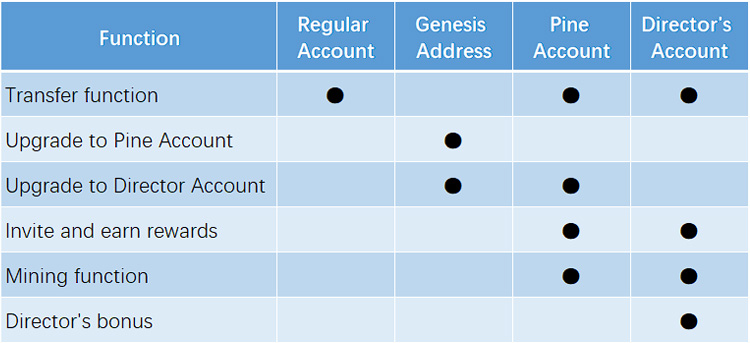

# Pinecone Token Account Types

**Standard Account**: This account type is the most basic account type, where users can use the account to trade and transfer Pinecone Tokens. Standard accounts do not have special privileges or functions.

**Genesis Account**: This account type is the initial account for Pinecone Tokens, with the authority to upgrade. Genesis accounts can be upgraded to Pine Tree or Director accounts, serving as the exclusive channel for account upgrades.

**Pine Tree Account**: This account type is designed for long-term holders of Pinecone Tokens. Pine Tree accounts can obtain PCT through mining by donating a lower amount. In addition, Pine Tree accounts can also participate in the governance and decision-making of Pinecone Tokens.

**Director Account**: This account type is designed for core members of Pinecone Tokens. Director accounts can participate in the governance and decision-making of Pinecone Tokens and have staking rights. By staking, Director accounts can obtain additional dividend income, encouraging them to contribute to the development of Pinecone Tokens.

#### Below is a simple chart displaying the functions and privileges of different account types: (The chart is missing in the provided text.)

<figure><figcaption></figcaption></figure>
