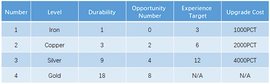

# Mysterious Key NFT

The Mysterious Key NFT (Non-Fungible Token) is one of the core components of the PineconeDAO platform, providing users with unique value and features. The following is a detailed explanation of the Mysterious Key NFT:

1.  **Acquisition**: When a user donates 10 pine trees on the PineconeDAO platform, they will receive a Mysterious Key NFT. Users can also participate in the blind box NFT event, with a chance to obtain a higher-level Mysterious Key NFT.

2. **Level System & Rarity**: Mysterious Key NFTs have different levels and rarities, divided into Iron, Copper, Silver, and Gold. The higher the level, the greater the chance for users to win big prizes when participating in the Lucky Treasure Box draw.

Below is a summary table of the Mysterious Key NFT's level, rarity, durability, chance number, experience point target, and upgrade cost:

<figure><figcaption></figcaption></figure>

<figure><figcaption></figcaption></figure>

**Iron Key**: In the legend, at the origin of wealth, there is a mysterious iron key. It represents the starting point and the primary stage of wise investment, bringing potential and opportunities to investors. The iron key has 1 point of durability and a chance number of 0. When investors accumulate 3 experience points on the PineconeDAO platform, they have the opportunity to upgrade the iron key to the more potential copper key at the cost of 1000 PCT.

<figure><figcaption></figcaption></figure>

**Copper Key**: As investors continuously accumulate experience and wisdom on the PineconeDAO platform, their iron keys gradually upgrade to the mysterious copper keys. The copper key symbolizes the growth and progress of investors, with 3 points of durability and a chance number of 2. When investors accumulate 6 experience points, they have the opportunity to upgrade the copper key to a more valuable silver key at the cost of 2000 PCT.

<figure><figcaption></figcaption></figure>

**Silver Key**: In the investment world of the PineconeDAO platform, those with the most wisdom and strength will obtain the mysterious silver key. The silver key represents outstanding investment achievements and wealth accumulation, with 9 points of durability and a chance number of 4. When investors accumulate 12 experience points, they will have the opportunity to upgrade the silver key to the legendary gold key at the cost of 4000 PCT.

<figure><figcaption></figcaption></figure>

**Gold Key**: In the investment legends of the PineconeDAO platform, the most outstanding investors will ultimately obtain the legendary gold key. As the highest level of the mysterious key currently, it symbolizes endless wealth and glory, with 18 points of durability and a chance number of 8. The gold key is already the highest level and does not need to be upgraded. Legend has it that investors who possess the gold key will receive the highest honor and endless wealth on the PineconeDAO platform.

3. **Participation in the Lucky Treasure Box event**: Users who hold the Mysterious Key NFT can participate in the PineconeDAO platform's Lucky Treasure Box draw event, with the chance to win generous rewards.
4. **Maintenance & Fees**: When the Mysterious Key NFT is damaged while participating in the Lucky Treasure Box event, users need to use PCT tokens for repairs. Of the maintenance fees, 20% will be destroyed, while the remaining 80% will be used for dividends and transferred to the director dividend contract.
5. **Trading & Collection**: Mysterious Key NFTs can be traded on the NFT market, where users can buy, sell, and collect different levels of Mysterious Key NFTs according to their needs and interests.
6. **Community Value**: The Mysterious Key NFT not only brings a rich gaming experience and rewards to users but also helps stimulate community vitality and promote the long-term development and prosperity of the PineconeDAO platform.


Through the Mysterious Key NFT, PineconeDAO platform provides users with a more interesting and exciting investment experience while helping to achieve a fair, transparent, and fun wealth growth method. The Mysterious Key NFT has unique functions and values in various aspects, bringing a rich gaming experience and rewards to users, while stimulating community vitality and promoting the long-term development and prosperity of the PineconeDAO platform.

